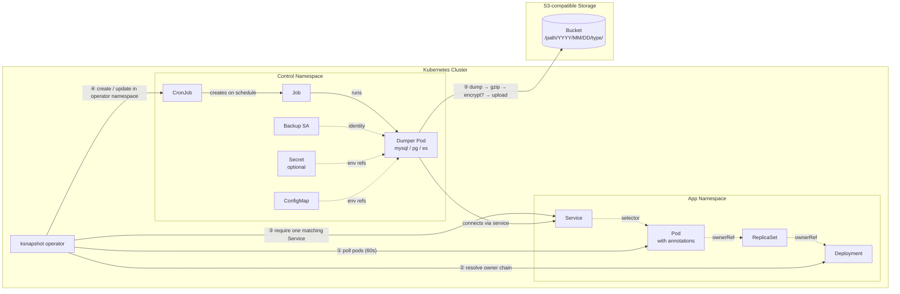

<p align="center">
  
</p>

# ksnapshot

A Kubernetes operator that takes scheduled snapshots of your MySQL, PostgreSQL, and Elasticsearch databases.

Annotate your pods with a cron schedule, and ksnapshot creates backup CronJobs, runs the dumps, compresses them, and uploads them to S3-compatible storage.

Compatible with AWS S3, Cloudflare R2, MinIO, DigitalOcean Spaces, and other S3-compatible providers.

## How it works

The operator polls configured namespaces every 60 seconds. For each annotated workload, it resolves the owner chain (Pod → ReplicaSet → Deployment when needed), requires exactly one selector-based Service for that workload, resolves supported database credential sources, mirrors only the required keys into an operator-managed Secret in the control namespace, and creates or updates a CronJob there. Backup jobs run under a dedicated ServiceAccount with no Kubernetes RBAC.

MySQL and PostgreSQL credential discovery supports:

- literal `env` values
- `env.valueFrom` references
- `envFrom` references

Dumps are organized in S3 by date: `/<path>/YYYY/MM/DD/<type>/`.



## Installation

### Helm (recommended)

```bash
helm repo add clickandmortar https://clickandmortar.github.io/ksnapshot
helm repo update
helm install ksnapshot clickandmortar/ksnapshot \
  -n ksnapshot --create-namespace \
  --set s3.bucket=my-backup-bucket
```

By default the chart watches only the `default` namespace. Set `rbac.watchNamespaces` to the namespaces that contain your annotated workloads.

See [chart README](chart/ksnapshot/README.md) for all values and credential options.

## Storage configuration

ksnapshot reads bucket configuration from a ConfigMap in the operator namespace. S3 credentials can come either from a Secret in that namespace or from the dedicated backup ServiceAccount identity (for example IRSA / Workload Identity).

### AWS S3

```yaml
apiVersion: v1
kind: Secret
metadata:
  name: ksnapshot-secret
  namespace: ksnapshot
type: Opaque
stringData:
  AWS_ACCESS_KEY_ID: "<your-access-key>"
  AWS_SECRET_ACCESS_KEY: "<your-secret-key>"
---
apiVersion: v1
kind: ConfigMap
metadata:
  name: ksnapshot-cm
  namespace: ksnapshot
data:
  S3_BUCKET: my-snapshot-bucket
  S3_REGION: eu-west-1
```

### Cloudflare R2

R2 is S3-compatible, so ksnapshot works out of the box. Skip `S3_REGION` and set `S3_ENDPOINT` to your R2 endpoint instead.

```yaml
apiVersion: v1
kind: Secret
metadata:
  name: ksnapshot-secret
  namespace: ksnapshot
type: Opaque
stringData:
  AWS_ACCESS_KEY_ID: "<your-r2-access-key>"
  AWS_SECRET_ACCESS_KEY: "<your-r2-secret-key>"
---
apiVersion: v1
kind: ConfigMap
metadata:
  name: ksnapshot-cm
  namespace: ksnapshot
data:
  S3_BUCKET: my-r2-bucket
  S3_ENDPOINT: "https://<account-id>.r2.cloudflarestorage.com"
```

You can generate R2 API tokens in the Cloudflare dashboard under **R2 > Manage R2 API Tokens**. Pick the "Object Read & Write" permission.

### Other S3-compatible providers

For MinIO, DigitalOcean Spaces, Backblaze B2, or similar: set `S3_ENDPOINT` to the provider's endpoint URL and either put the credentials in the Secret or annotate the backup-job ServiceAccount with your cloud identity configuration.

| ConfigMap key | Description | Required |
|--------------|-------------|----------|
| `S3_BUCKET` | Bucket name | Yes |
| `S3_REGION` | AWS region (for example `eu-west-1`) | No |
| `S3_ENDPOINT` | Custom S3 endpoint URL for non-AWS providers. Takes precedence over `S3_REGION` | No |

> [!NOTE]
> Set either `S3_REGION` or `S3_ENDPOINT`. If both are set, `S3_ENDPOINT` is used.

## Usage

Add annotations to your database pods to schedule snapshots:

```yaml
metadata:
  annotations:
    ksnapshot.clickandmortar.fr/enabled: "true"
    ksnapshot.clickandmortar.fr/type: "mysql"
    ksnapshot.clickandmortar.fr/schedule: "0 3 * * *"
```

Requirements:

- The annotated workload must be exposed by exactly one selector-based Service in its namespace.
- MySQL and PostgreSQL credentials can come from literal `env`, `env.valueFrom`, or `envFrom` on the source container. ksnapshot resolves those sources in the watched namespace and mirrors only the supported keys into a generated Secret in the control namespace.
- Backups are created once per workload owner, not once per pod replica.

### Annotations

| Annotation | Description | Required | Default |
|-----------|-------------|----------|---------|
| `ksnapshot.clickandmortar.fr/enabled` | Enable snapshots for this pod | Yes | `false` |
| `ksnapshot.clickandmortar.fr/schedule` | Cron schedule expression | Yes | |
| `ksnapshot.clickandmortar.fr/type` | `mysql`, `elasticsearch`, or `postgresql` | Yes | |
| `ksnapshot.clickandmortar.fr/timezone` | Timezone for the schedule | No | `Etc/UTC` |
| `ksnapshot.clickandmortar.fr/version` | Database version (`5.7` or `8` for mysql, `16` for postgresql) | No | `8` (mysql), `16` (postgresql) |
| `ksnapshot.clickandmortar.fr/elasticsearch-limit` | Page size for Elasticsearch dumps | No | `1000` |
| `ksnapshot.clickandmortar.fr/encryption-enabled` | Enable [age](https://github.com/FiloSottile/age) encryption before upload | No | `false` |
| `ksnapshot.clickandmortar.fr/encryption-recipient` | age recipient public key (required when encryption is enabled) | No | |

> [!WARNING]
> All annotation values must be strings. Wrap numbers and booleans in quotes.

## Supported databases

| Database | Dump method | Versions |
|----------|------------|----------|
| MySQL | `mysqldump --single-transaction` | 5.7, 8 |
| PostgreSQL | `pg_dump` | 16 |
| Elasticsearch | `elasticdump` (auto-detects version) | Auto |

Dumps are gzip-compressed before upload. All dumpers support optional [age](https://github.com/FiloSottile/age) encryption.

## Encryption

ksnapshot supports client-side encryption using [age](https://github.com/FiloSottile/age). When enabled, dumps are encrypted after compression and before upload to S3, producing `.age` suffixed files.

```yaml
metadata:
  annotations:
    ksnapshot.clickandmortar.fr/encryption-enabled: "true"
    ksnapshot.clickandmortar.fr/encryption-recipient: "age1ql3z7hjy54pw3hyww5ayyfg7zqgvc7w3j2elw8zmrj2kg5sfn9aqmcac8p"
```

To decrypt a snapshot:

```bash
age -d -i key.txt snapshot.sql.gz.age > snapshot.sql.gz
```

## Development

```shell
nvm use           # Node 22
npm install
npm run dev       # Watch mode
npm run lint      # ESLint
npm test          # Unit + dumper tests
```

Docker images:

```shell
make build        # builds ghcr.io/clickandmortar/* images tagged with VERSION (default: dev)
make push         # pushes ghcr.io/clickandmortar/* images tagged with VERSION
```

## Roadmap

- [ ] Debugging via `debug` package
- [ ] Prometheus metrics
- [ ] PVC / PV support for large dumps
- [ ] Configurable resource requests/limits on dumpers
- [ ] Per-table MySQL dumps
- [ ] Persistent volume backups with conditional triggers

## License

See [LICENSE](LICENSE).
