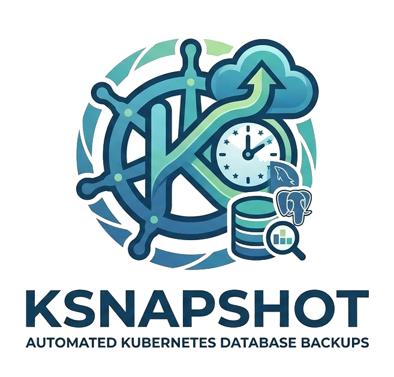

<p align="center">
  
</p>

# ksnapshot

A Kubernetes operator that takes scheduled snapshots of your MySQL, PostgreSQL, and Elasticsearch databases.

Annotate your pods with a cron schedule, and ksnapshot creates the CronJobs, runs the dumps, compresses them, and uploads to S3.

Compatible with AWS S3, Cloudflare R2, MinIO, DigitalOcean Spaces, and other S3-compatible providers.

## How it works

The operator polls running pods every 60 seconds. For each pod with ksnapshot annotations, it resolves the owner chain (Pod → ReplicaSet → Deployment), finds the matching Service, and creates or updates a CronJob in the `ksnapshot` namespace. When annotated pods disappear, the corresponding CronJobs get cleaned up.

Dumps are organized in S3 by date: `/<path>/YYYY/MM/DD/<type>/`.

## Installation

```shell
kubectl create namespace ksnapshot

kubectl apply -f https://raw.githubusercontent.com/ClickAndMortar/ksnapshot/main/manifests/deployment/ksnapshot-sa.yaml
kubectl apply -f https://raw.githubusercontent.com/ClickAndMortar/ksnapshot/main/manifests/deployment/ksnapshot-cr.yaml
kubectl apply -f https://raw.githubusercontent.com/ClickAndMortar/ksnapshot/main/manifests/deployment/ksnapshot-crb.yaml
kubectl apply -f https://raw.githubusercontent.com/ClickAndMortar/ksnapshot/main/manifests/deployment/ksnapshot-deployment.yaml
```

## Storage configuration

ksnapshot reads storage credentials from a Secret and bucket configuration from a ConfigMap, both in the `ksnapshot` namespace.

### AWS S3

```yaml
apiVersion: v1
kind: Secret
metadata:
  name: ksnapshot-secret
  namespace: ksnapshot
type: Opaque
stringData:
  AWS_ACCESS_KEY_ID: "<your-access-key>"
  AWS_SECRET_ACCESS_KEY: "<your-secret-key>"
---
apiVersion: v1
kind: ConfigMap
metadata:
  name: ksnapshot-cm
  namespace: ksnapshot
data:
  S3_BUCKET: my-snapshot-bucket
  S3_REGION: eu-west-1
```

### Cloudflare R2

R2 is S3-compatible, so ksnapshot works out of the box. Skip `S3_REGION` and set `S3_ENDPOINT` to your R2 endpoint instead.

```yaml
apiVersion: v1
kind: Secret
metadata:
  name: ksnapshot-secret
  namespace: ksnapshot
type: Opaque
stringData:
  AWS_ACCESS_KEY_ID: "<your-r2-access-key>"
  AWS_SECRET_ACCESS_KEY: "<your-r2-secret-key>"
---
apiVersion: v1
kind: ConfigMap
metadata:
  name: ksnapshot-cm
  namespace: ksnapshot
data:
  S3_BUCKET: my-r2-bucket
  S3_ENDPOINT: "https://<account-id>.r2.cloudflarestorage.com"
```

You can generate R2 API tokens in the Cloudflare dashboard under **R2 > Manage R2 API Tokens**. Pick the "Object Read & Write" permission.

### Other S3-compatible providers

For MinIO, DigitalOcean Spaces, Backblaze B2, or similar: set `S3_ENDPOINT` to the provider's endpoint URL and put the credentials in the Secret.

| ConfigMap key | Description | Required |
|--------------|-------------|----------|
| `S3_BUCKET` | Bucket name | Yes |
| `S3_REGION` | AWS region (e.g. `eu-west-1`). When set, the endpoint defaults to `https://s3.<region>.amazonaws.com/` | No |
| `S3_ENDPOINT` | Custom S3 endpoint URL for non-AWS providers. Takes precedence over `S3_REGION` | No |

> [!NOTE]
> Set either `S3_REGION` (for AWS) or `S3_ENDPOINT` (for everything else). If both are set, `S3_ENDPOINT` is used.

## Usage

Add annotations to your database pods to schedule snapshots:

```yaml
metadata:
  annotations:
    ksnapshot.clickandmortar.fr/enabled: "true"
    ksnapshot.clickandmortar.fr/type: "mysql"
    ksnapshot.clickandmortar.fr/schedule: "0 3 * * *"
```

### Annotations

| Annotation | Description | Required | Default |
|-----------|-------------|----------|---------|
| `ksnapshot.clickandmortar.fr/enabled` | Enable snapshots for this pod | Yes | `false` |
| `ksnapshot.clickandmortar.fr/schedule` | Cron schedule expression | Yes | |
| `ksnapshot.clickandmortar.fr/type` | `mysql`, `elasticsearch`, or `postgresql` | Yes | |
| `ksnapshot.clickandmortar.fr/timezone` | Timezone for the schedule | No | `Etc/UTC` |
| `ksnapshot.clickandmortar.fr/version` | Database version (`5.7` or `8` for mysql, `16` for postgresql) | No | `8` (mysql), `16` (postgresql) |
| `ksnapshot.clickandmortar.fr/elasticsearch-limit` | Page size for Elasticsearch dumps | No | `1000` |

> [!WARNING]
> All annotation values must be strings. Wrap numbers and booleans in quotes.

## Supported databases

| Database | Dump method | Versions |
|----------|------------|----------|
| MySQL | `mysqldump --single-transaction` | 5.7, 8 |
| PostgreSQL | `pg_dump` | 16 |
| Elasticsearch | `elasticdump` (auto-detects version) | Auto |

Dumps are gzip-compressed before upload. MySQL and PostgreSQL dumpers support optional [age](https://github.com/FiloSottile/age) encryption.

## Development

```shell
nvm use           # Node 22
npm install
npm run dev       # Watch mode
npm run lint      # ESLint
```

Docker images:

```shell
make build        # docker build -t clickandmortar/ksnapshot:latest .
make push         # docker push clickandmortar/ksnapshot:latest
```

## Roadmap

- [ ] Debugging via `debug` package
- [ ] Prometheus metrics
- [ ] Encryption with AWS KMS before upload
- [ ] PVC / PV support for large dumps
- [ ] Configurable resource requests/limits on dumpers
- [ ] Per-table MySQL dumps
- [ ] Persistent volume backups with conditional triggers

## License

See [LICENSE](LICENSE).
